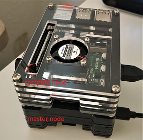

# Raspberry-Pi cluster
The aim of this repo is to setup a test raspberry pi cluster for HPC purposes.



## Currently:
- [SLURM](https://github.com/SchedMD/slurm) version `20.02` workload manager was built from source code and was successfully tested on `Raspbian Buster 64bit` 
- Infrastructure (`Raspberry Pi 4 2GB`): 
    - 1 master (hostname `node01`)
    - 1 compute node (hostname `node02`)
    - 0 login node

## Installation:
Instructions are pretty much as are stated in `https://github.com/mknoxnv/ubuntu-slurm` except minor changes are required as follows:
- some prerequisite packages are different on `raspbian` (e.g. libmariadbclient)
- `aarch64` architecture instead of `x86_64` (--enable-pam --with-pam_dir=/lib/aarch64-linux-gnu/security/
- `slurm.conf`
- `slurmdbd.conf`
- enable cgroup memory (`/boot/cmdline.txt`)

## Multi-node:
- set `master` and `compute` node hostnames in `/etc/hosts`
- copy the `munge.key` of `master` node into the 'compute' nodes 
- enable and start `slurmd` on `compute` nodes
- same `slurm.conf` between all nodes
- NFS from master to all compute nodes

Check nodes:
```
sinfo
srun --nodes=2 hostname
```
Update the states of a node:
```
scontrol update nodename=node02 state=idle
```

## Network file share (NFS):
`/home` and `/nfs` have to be mounted from the master node. 

on the moster, append bellow to `/etc/exports`:
```
/nfs *(rw,sync,no_root_squash)
/home *(rw,sync,no_root_squash,no_subtree_check)
```

on all compute nodes, append bellow to `/etc/fstab`
```
node01:/nfs /nfs nfs auto 0 0
node01:/home /home nfs auto 0 0
```

If automatic mounting in `fastb` doesn't work try:
```
sudo raspi-config
```
and selecting __wait__ for the network at boot/Yes.

Modules and python environments can be built on master nodes and shared through NFS to other compute nodes, such as `/nfs/envs`. So, other compute nodes execute them without the need to install them on each node separately.

## Login node:
`Login node` is required in order to limit, or even block, users access to master and compute nodes for security reasons. On the other side, users have to be able to test their codes and submit their jobs from the login node(s). 

Logging node is in fact a `compute node` that is not used in any of `partitions`. This allows users to remotely connect, through ssh, and submit jobs.

It can be configured by simply removing the login node's hostname from partition nodes of the `slurm.conf` file. 

## Setup jupyterhub:
Conda or Miniconda, at this moment, does not support jupyterhub installation on raspberry pi. Therefore, it requires to directly install it from `apt-get python3-pip` and `pip3` commands.

It is recommended to install jupyterhub as a separate environment. For simplicity reason, we install it directly on `/use/local/` and call it without activating any environment. Nevertheless, jupyterhub loads different kernels, which are shared between all nodes, in order to manage different python environments.     

How to install jupyterhub:
```
sudo apt-get update 
sudo apt-get install python3-pip 
sudo -H pip3 install --upgrade pip

sudo apt-get install npm 
sudo npm install -g configurable-http-proxy

sudo install libffi-dev
sudo -H pip3 install notebook jupyterhub
```

`master` node: it requires jupyterhub and its config file (see `jupyterhub_config.py`).Also `batchspawner` and `wrapspawner` have to installed, from their git repos, in order to allocate resource, using Slurm, to the spanwned notebooks. 

Master node is the place where jupyterhub service runs and then users access the service through the preset jupyterhub `ip` and `port` in the config file (secure it with ssl certificate).

`compute` node: only `notebook` and `batchspawner` are required.


## Add jupyter kernels:
To have a list of different python kernels, we need to create separate environments using `virtualenv` and share them between all nodes using NFS directory (`/nfs/envs` directory for example). There is also need to share jupyterhub kernels directory (`/usr/local/share/jupyter/kernels/`) to let the jupyterhub knows how to load the kernel (see `kernel.json` file). Now, we can simply modify or create new python environments on the master node and have it loaded on compute nodes as well.

If you face a problem in runninf the loaded kernel, try install `pip install ipykernel` inside the environment.

How to make and add new kernel:
```
cd /nfs/envs
python3 -m venv newenv

source newenvs/bin/activate
pip install --upgrade pip
pip install ipykernel
pip install [packages]
deactivate

python3 -m ipykernel install --name newenv --display-name "New Env"
```

Modify the `argv` key in `/usr/local/share/jupyter/kernels/newenv/kernel.json` and set the python path to the just created environment which is `/nfs/envs/newenv/bin/python`. New kernel is now visible in the list of notebooks for all nodes without any need to restart the jupyterhub service.

