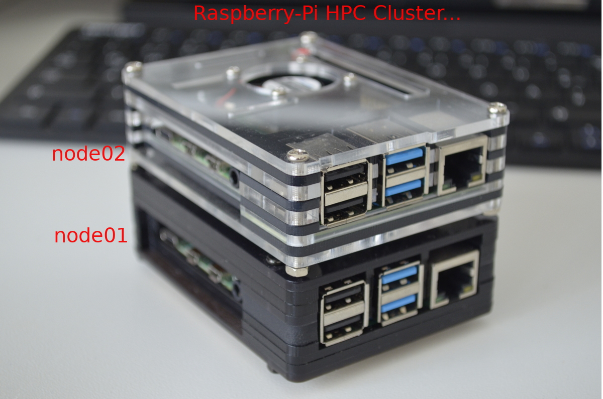
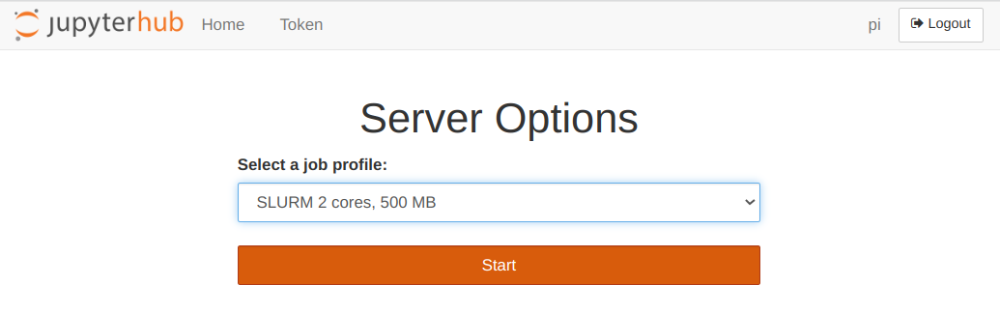
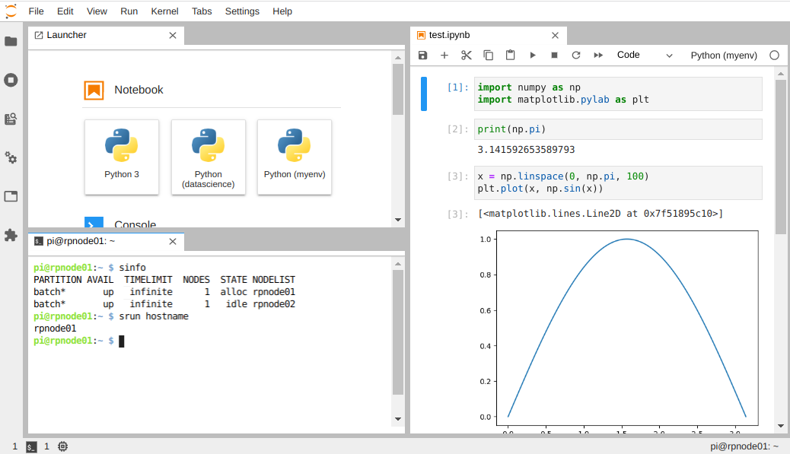

# Raspberry-Pi HPC Cluster
In this repository, I document my endeavor to construct a scalable high-performance computing (HPC) cluster using [Raspberry Pi](https://en.wikipedia.org/wiki/Raspberry_Pi), specifically tailored for data science applications. 
The knowledge gained from this tutorial aims to assist you in building your own functional HPC cluster, capable of accommodating hundreds of compute nodes, and supporting both web-based (e.g. jupyterhub) and command-line interfaces.

<!--  -->


## Implemented Features
- [Slurm](https://slurm.schedmd.com/overview.html) workload manager for efficient job management.
- Batch job submission capabilities to facilitate scheduling and execution.
- Integration of [JupyterHub](https://jupyter.org/hub) service with Slurm, enabling interactive notebook usage.
- Network file sharing through NFS (Network File System).
- Disk quota management for users and groups.
- Conda package management for Python/R environments.
- Environment module management facilitated by [Lmod](https://lmod.readthedocs.io/en/latest/).
- Support for parallel MPI (Message Passing Interface) applications, integrated with Slurm.


## Infrastructure
The infrastructure consists of the following components:
- Raspberry Pi 3+ 1GB board (`rplogin01`)
  - Functions as the login node and jupyter node.
- Raspberry Pi 4 model B 2GB board (`rpnode01`)
  - Serves as the master node, NFS storage node, and compute node.
- Raspberry Pi 4 model B 2GB board (`rpnode02`)
  - Operates as a compute node.
- Ethernet switch
- USB power hub

## Operating system
Raspbian Buster 64 bit

## Test Users

(username/password):

- `pi` / `testpass`

# Table of Contents

- [Slurm](#Slurm)
- [Storage](#Storage)
- [Jupyterhub](#Jupyterhub)
- [Software stack](#Software-stack)
- [MPI](#MPI)

# SLURM

## Install

Instructions are pretty much as are stated in [ubuntu-slurm](https://github.com/mknoxnv/ubuntu-slurm)
except some changes which are required as follows:

- some prerequisite packages are different on `raspbian` (e.g. libmariadbclient)
- configure and install slurm for `aarch64` architecture instead of `x86_64` \
  _Note 1:_ use `--with-pmix` if slurm integration with MPI is intended \
  _Note 2:_ `make install` pmi include/lib files in `slurm/contribs` before `fpg` command (therefore pmi files will be installed later in `/usr`)
  ```angular2html
  $ ./configure --prefix=/nfs/apps/slurm-build --sysconfdir=/etc/slurm --enable-pam --with-pam_dir=/lib/aarch64-linux-gnu/security/ --without-shared-libslurm --with-pmix
  $ make
  $ make contrib
  $ make install
  $ cd ..
  $ fpm -s dir -t deb -v 1.0 -n slurm-20.02 --prefix=/usr -C /nfs/apps/slurm-build .
  $ dpkg -i slurm-20.02_1.0_arm64.deb
  ```
- `slurm.conf`
- `slurmdbd.conf`
- enable cgroup memory (`/boot/cmdline.txt`)

## Nodes

- set `master` and `compute` node hostnames in `/etc/hosts`
- copy the `munge.key` of the `master` node to the `compute` nodes
- enable and start `slurmd` on `compute` nodes
- same `slurm.conf` between all nodes
- export NFS from master to all compute nodes

Check nodes:

```
$ sinfo
$ srun hostname
```

Update the states of the node:

```
$ scontrol update nodename=rpnode02 state=idle
```

### Login Node

`Login node` is required in order to limit, or even block, users access to master and compute nodes for security reasons. On the other side, users have to be able to test their codes and submit their jobs from the login node(s).

The login node is in fact a `compute node` that is not used in any of `partitions`. This allows users to remotely connect, through ssh, and submit jobs.

It can be configured by simply removing the login node's hostname from partition nodes of the `slurm.conf` file.

## SLURM PAM

This is used to limit/prevent users direct access to the compute nodes.
On each compute node you should copy pam_slurm.so to linux kernel security directory and add extra config to `/etc/pamd.d/sshd` file.

```bash
$ cp /nfs/slurm-20/contribs/pam/.libs/pam_slurm.so /lib/aarch64-linux-gnu/security/
$ vi /etc/pam.d/sshd
$ account    required     /lib/aarch64-linux-gnu/security/pam_slurm.so
```

Above settings allows ssh access only to those users who have an active job on the compute node.

A better solution is to block all (unprivileged) users except a list of allowed users (e.g. admin) who can directly access compute nodes
either having active jobs or not.
To do so create an allowed users list in `ssh` directory

```
$ nano /etc/ssh/allowed_users
root
admin

$ chmod 600 /etc/ssh/allowed_users
```

check file `/lib/aarch64-linux-gnu/security/pam_listfile.so`
Then add following line **before** `pam_slurm.so` config:

```bash
account    sufficient    pam_listfile.so item=user sense=allow file=/etc/ssh/allowed_users onerr=fail
```

How to check users access (let's say `rpnode02` has limited access):

```bash
$ ssh user2@rpnode02
Access denied!

$ ssh user2@rpnode01
$ salloc -N 1 --mem=100mb -w rpnode02
$ srun hostname
rpnode02
```

But admin users have access no `rpnode02`. \
See [here](https://slurm.schedmd.com/faq.html) for more details

# Storage

## NFS

`/home` and `/nfs` have to be mounted from the master node (`rpnode01`).

On the master, append bellow to `/etc/exports`:

```
/nfs *(rw,sync,no_root_squash,no_subtree_check)
/home *(rw,sync,no_root_squash,no_subtree_check)
```

on all compute nodes, append bellow to `/etc/fstab`

```bash
rpnode01:/nfs /nfs nfs auto 0 0
rpnode01:/home /home nfs auto 0 0
```

If automatic mounting in `fastb` doesn't work try:

```bash
$ sudo raspi-config
```

and selecting **wait** for the network at boot/Yes.

Modules and python environments can be built on master nodes and shared through NFS to other compute nodes, such as `/nfs/envs`. So, other compute nodes execute them without the need to install them on each node separately.

## Disk Quota

First install `quota` using apt and add `usrquoata` and `grpquota` for `/etc/fstab`. \
see [here](https://linuxhint.com/disk_quota_ubuntu/) and [here](https://docs.oracle.com/cd/E19455-01/805-7229/6j6q8svfg/index.html#sysresquotas-82495) for more details.

if you confronted the ` Cannot stat() mounted device /dev/root` then linked the partition as

```bash
$ lsblk
$ ln -s /dev/mmcblk0p2 /dev/root
$ quotacheck -cum /
$ quotacheck -cgm /
$ quotaon -v /
$ repquota -a
```

How to set soft and hard limit for a user:

```bash
$ edquota user1
$ repquota -a
```

each `blocksize` in linux system by default is `1KB`.
even NFS exported dirs respect quota if UIDs and GIDs remain consistent across nodes.
But a better solution is to configure NFS-server to take into account exported dirs for clients.

# Jupyterhub

Conda or Miniconda, at this moment, does not support jupyterhub installation on raspberry pi. Therefore, it requires to directly install it from `apt-get python3-pip` and `pip3` commands.

It is recommended to install jupyterhub as a separate environment. For simplicity reason, we install it directly on `/use/local/` and call it without activating any environment. Nevertheless, jupyterhub loads different kernels, which are shared between all nodes, in order to manage different python environments.

How to install jupyterhub:

```bash
$ sudo apt-get update
$ sudo apt-get install python3-pip
$ sudo -H pip3 install --upgrade pip

$ sudo apt-get install npm
$ sudo npm install -g configurable-http-proxy

$ sudo install libffi-dev
$ sudo -H pip3 install notebook jupyterhub
```

`master` node: it requires jupyterhub and its config file (see `jupyterhub_config.py`).Also `batchspawner` and `wrapspawner` have to installed, from their git repos, in order to allocate resource, using Slurm, to the spawned notebooks.

Master node is the place where jupyterhub service runs and then users access the service through the preset jupyterhub `ip` and `port` in the config file (secure it with ssl certificate).

`compute` node: only `notebook` and `batchspawner` are required.

## Add Kernels

To have a list of different python kernels, we need to create separate environments using `virtualenv` and share them between all nodes using NFS directory (`/nfs/envs` directory for example). There is also need to share jupyterhub kernels directory (`/usr/local/share/jupyter/kernels/`) to let the jupyterhub knows how to load the kernel (see `kernel.json` file). Now, we can simply modify or create new python environments on the master node and have it loaded on compute nodes as well.

If you face a problem in `runninf` the loaded kernel, try install `pip install ipykernel` inside the environment.

How to make and add new kernel:

```bash
$ cd /nfs/envs
$ python3 -m venv newenv

$ source newenvs/bin/activate
$ pip install --upgrade pip
$ pip install ipykernel
$ pip install [packages]
$ deactivate

$ python3 -m ipykernel install --name newenv --display-name "New Env"
```

Modify the `argv` key in `/usr/local/share/jupyter/kernels/newenv/kernel.json` and set the python path to the just created environment which is `/nfs/envs/newenv/bin/python`. New kernel is now visible in the list of notebooks for all nodes without any need to restart the jupyterhub service.

# Software Stack

## Environment Module

Environment Module (Lmod) is a Lua based environment module system that reads TCL modulefiles.

First install `lua` from source

```bash
$ wget https://sourceforge.net/projects/lmod/files/lua-5.1.4.9.tar.bz2
$ tar xf lua-5.1.4.9.tar.bz2
$ ./configure --prefix=/nfs/apps/lua/5.1.4.9
$ make; make install
$ cd /nfs/apps/lua; ln -s 5.1.4.9 lua; ln -s 5.1.4.9 luac
$ ln -s /nfs/apps/lua/lua/bin/lua /usr/local/bin  # or add lua to PATH
$ ln -s /nfs/apps/lua/lua/bin/luac /usr/local/bin
```

Then install `Lmod`

```bash
$ wget https://sourceforge.net/projects/lmod/files/Lmod-8.4.tar.bz2
$ tar xf Lmod-8.4.tar.bz2

$ apt install tclsh lua-posix lua-term
$ ./configure --prefix=/nfs/apps --with-fastTCLInterp=no
$ make install
```

`Lmod` initialization script for the bash and zsh shells

```bash
$ ln -s /nfs/apps/lmod/lmod/init/profile        /etc/profile.d/z00_lmod.sh
$ ln -s /nfs/apps/lmod/lmod/init/cshrc          /etc/profile.d/z00_lmod.csh
```

_Note:_ for other nodes, simply making above links at `/etc/profile.d/` would be sufficient.

consider adding the following to `/etc/bash.bashrc`:

```bash
if ! shopt -q login_shell; then
  if [ -d /etc/profile.d ]; then
    for i in /etc/profile.d/*.sh; do
      if [ -r $i ]; then
        . $i
      fi
    done
  fi
fi
```

This is useful because non-login interactive shells only source `/etc/bash.bashrc`
and this file doesn’t normally source the files in `/etc/profile.d/*.sh`. \
See [here](https://lmod.readthedocs.io/en/latest/030_installing.html) for more details

### Modulefile

Sample lua module file `7.4.0.lua`

```bash
help([[
This is the module file for the GCC compiler.
]])

local version = "7.4.0"

whatis("Name: GCC compiler (system default)")
whatis("Version: " .. version)
whatis("Keywords: System, Compiler")
whatis("URL: http://www.gnu.org/")
whatis("Description: GNU compiler family")

family("compiler")

local prefix = "/usr/bin"

setenv("CC",  pathJoin(prefix, "gcc-7"))
setenv("CXX", pathJoin(prefix, "g++-7"))
setenv("FC",  pathJoin(prefix, "fc"))
setenv("C77", pathJoin(prefix, "fc"))

local mroot = os.getenv("MODULEPATH_ROOT")
local mdir = pathJoin(mroot, "GCC", version)
prepend_path("MODULEPATH", mdir)
```

_Note_: It is better to install modules in separate directories (using --prefix) in order to avoid module conflicts. \
Example can be seen [here](https://www.ivofilot.nl/posts/view/23/How+to+install+and+use+the+environment+modules+system)

an example of module file structure:

```angular2html
/nfs/apps/modulefiles
└── Linux
    └── GCC
        ├── 7.4.0.lua
        └── 8.3.0.lua
```

# MPI

First Slurm has to be built `--with-pmix` then MPI implementation will use PMI files generated by
Slurm in `contribs` directories (see [here](https://slurm.schedmd.com/mpi_guide.html) and [here](https://wiki.fysik.dtu.dk/niflheim/SLURM))
.

Let's first list available MPI types in your current slurm installation

```
$ srun --mpi=list
MPI types are...
pmi2
none
cray_shasta
```

There should be `pmi` and/or `pmi2`. \
_Note:_ It seems Slurm generate pmi include/lib files by default (it can be checked in contribs directories).
If so the only step is to link the MPI implementation library with the generated PMI files (next section).

## Open MPI

You should build Open MPI with `--with-slurm` option (see [here](https://www.open-mpi.org/faq/?category=building)).
This allows Slurm managing reservations of communication ports for use by the Open MPI.

But first you need to `make install` pmi in `slurm/contribs/pmi` and `slurm/contribs/pmi2`.
Then, the required include and lib files are available in `slurm-build` directories.

Build OpenMPI with `slurm` and `pmi` using:

```bash
$ wget https://download.open-mpi.org/release/open-mpi/v4.1/openmpi-4.1.0.tar.bz2
$ tar xf openmpi-4.1.0.tar.bz2
$  ./configure --prefix=/nfs/apps/OpenMPI/4.1.0 --with-slurm=/usr --with-pmi=/nfs/apps/slurm-build
$ make install all
```

How to test MPI integration

```bash
$ module load OpenMPI
$ srun -n 4 --mpi=pmi2 mpi_example.x
Hello world from processor rpnode01, rank 0 out of 4 processors
Hello world from processor rpnode01, rank 1 out of 4 processors
Hello world from processor rpnode01, rank 2 out of 4 processors
Hello world from processor rpnode01, rank 3 out of 4 processors
```

Or set `MPIDefault=pmi2` in `slurm.conf` to use `srun` without `--mpi=pmi2` flag.

For sbatch file `--tasks` flag determines number of MPI processes
and `cpus-per-task` number of cores for each process

```bash
#!/bin/sh
...
#SBATCH --tasks=4
#SBATCH --cpus-per-task=1

module load OpenMPI

srun mpi_example.x
mpirun mpi_example.x  # mpirun works as well
```

## Snapshots







